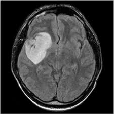

# MRI Image Enhancement Using SwinIR

Brain tumors require precise and early diagnosis for effective treatment. This project employs the SwinIR model to enhance the clarity and details of MRI scans, aiding in clearer tumor visualization and potentially improving diagnostic accuracy.

## Table of Contents

- [Usage](#usage)
- [Data](#data)
- [Results](#results)
- [Acknowledgments](#acknowledgments)


## Usage

Provide the path to the MRI image you wish to enhance:

```python
from swinir_model import SwinIR
model = SwinIR()
enhanced_image = model.enhance('path_to_image.jpg')
```

## Data

The dataset used comprises MRI scans, both with and without brain tumors, sourced from a Kaggle repository. You can find the dataset [here](https://www.kaggle.com/datasets/navoneel/brain-mri-images-for-brain-tumor-detection).

## Results

- Significant improvement in the clarity of details in MRI images, especially in regions where tumors were present.
- Minor artifacts in some MRI scans after processing.

<p align="center">
  
  <br>
  <i>Low-quality Image</i>
</p>

<p align="center">
  
  <br>
  <i>High-quality Image</i>
</p>

## Acknowledgments

- Thanks to Navoneel, C. for the MRI dataset on Kaggle.
- The SwinIR team for their amazing work and providing the base model.
